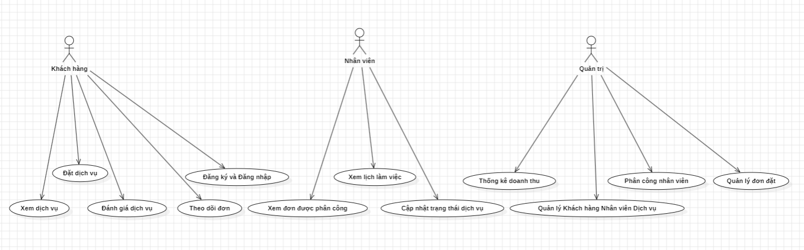

# 6. USE CASE

## 6.1. Tác nhân

Hệ thống gồm các tác nhân chính:

* **Khách hàng:** Đăng ký, đăng nhập, tìm kiếm dịch vụ, đặt lịch, thanh toán, theo dõi và đánh giá đơn.
* **Nhân viên:** Xem lịch làm việc và xử lý các đơn được phân công.
* **Quản trị viên:** Quản lý người dùng, dịch vụ, nhân viên, đơn đặt lịch và thống kê.

## 6.2. Danh sách Use Case

### Khách hàng

* Đăng ký tài khoản.
* Đăng nhập / Đăng xuất.
* Quản lý thông tin cá nhân.
* Xem danh sách dịch vụ.
* Xem chi tiết dịch vụ.
* Chọn địa chỉ và thời gian.
* Đặt dịch vụ.
* Thanh toán.
* Xem lịch sử đặt dịch vụ.
* Theo dõi trạng thái đơn.
* Hủy đơn.
* Đánh giá dịch vụ.

### Nhân viên

* Đăng nhập.
* Xem lịch làm việc.
* Xem đơn được phân công.
* Cập nhật trạng thái thực hiện dịch vụ.
* Xem thông tin khách hàng và đơn hàng.

### Quản trị viên

* Đăng nhập quản trị.
* Quản lý khách hàng.
* Quản lý nhân viên.
* Quản lý dịch vụ.
* Quản lý lịch đặt.
* Phân công nhân viên.
* Xác nhận / từ chối đơn.
* Quản lý thanh toán.
* Quản lý đánh giá.
* Xem thống kê và doanh thu.

## 6.3. Quan hệ Use Case chính

KHÁCH HÀNG
   │
   ├── Đăng ký / Đăng nhập
   ├── Xem dịch vụ
   ├── Đặt dịch vụ
   │      ├── Chọn địa chỉ
   │      ├── Chọn thời gian
   │      └── Thanh toán
   ├── Theo dõi đơn
   ├── Hủy đơn
   └── Đánh giá dịch vụ

NHÂN VIÊN
   │
   ├── Xem lịch làm việc
   ├── Xem đơn được phân công
   └── Cập nhật trạng thái dịch vụ

QUẢN TRỊ VIÊN
   │
   ├── Quản lý khách hàng
   ├── Quản lý nhân viên
   ├── Quản lý dịch vụ
   ├── Quản lý đơn đặt
   ├── Phân công nhân viên
   └── Thống kê / Doanh thu

## 6.4. Use Case tổng quát

Sơ đồ dưới đây mô tả các tác nhân và chức năng chính của hệ thống:

  